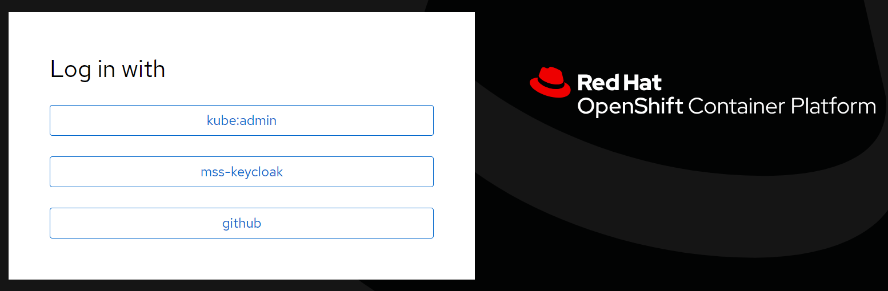
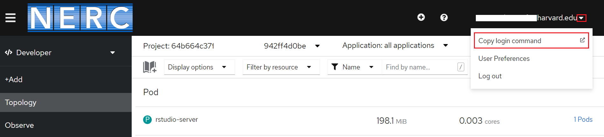
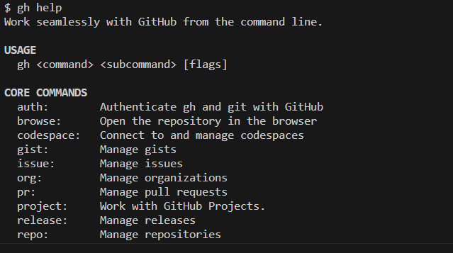
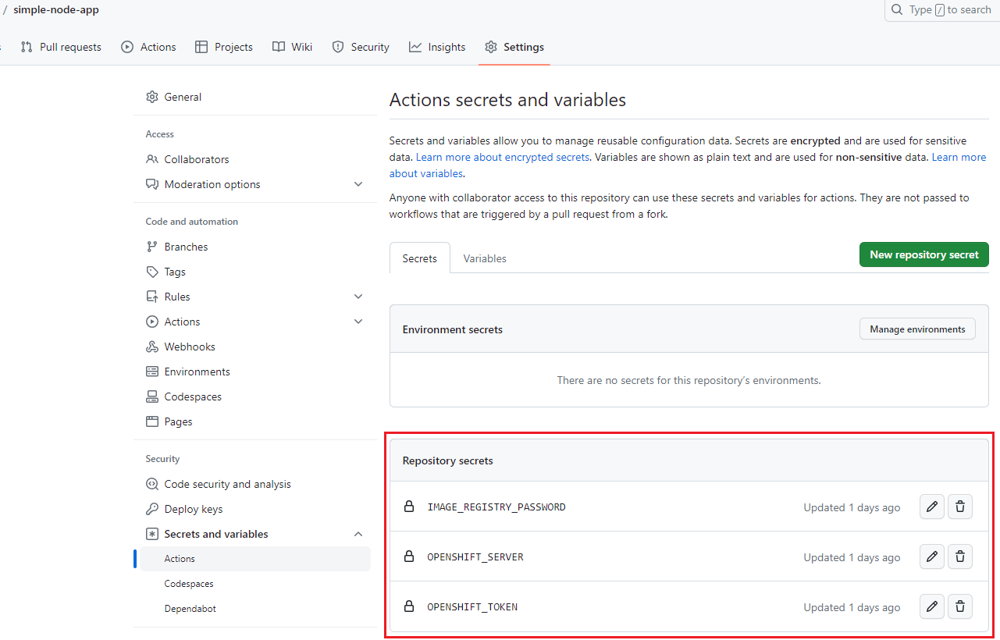
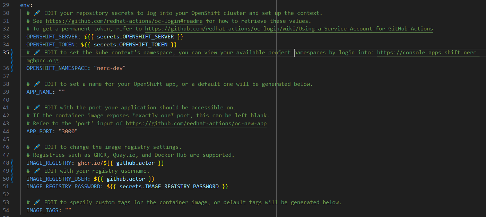
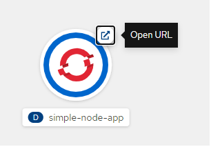

# Nodeapp

## Build and Deploy a containerized Node app to NERC's OpenShift cluster.

This demo Node.js application shows a simple container based app can easily be
bootstrapped onto NERC's OpenShift (OCP) cluster using CI/CD Pipeline by GitHub
Actions.

You can try it out by forking this sample app or use your own container based application.
 
| Step        |             |
| ----------- | ----------- |
| 1. Get an access to the NERC's OpenShift Container Platform at https://console.apps.shift.nerc.mghpcc.org. To get access NERC's OCP web console you need to be part of ColdFront's active allocation as described [here](https://nerc-project.github.io/nerc-docs/get-started/get-an-allocation/#request-a-new-openshift-resource-allocation-for-openshift-project). |        |
| 2. Setup the OpenShift CLI Tools locally and Configuring the OpenShift CLI to enable `oc` commands. Refer to [this user guide]( https://nerc-project.github.io/nerc-docs/openshift/logging-in/setup-the-openshift-cli/). |        |
| 3. Setup Github CLI on your local machine: https://docs.github.com/en/github-cli/github-cli/quickstart and verify you are able to run `gh` commands. |        |
| 4. Run either the `setsecret.cmd` file if you are using Windows or the `setsecret.sh` file if you are on a Linux-based machine. Once executed, verify that the GitHub Secrets are set properly under your repository's **Settings >> Secrets and Variables >> Actions**, as shown here. **NOTE:** If you are using the **GitHub Container Registry (GHCR)**, you do **not** need to set other registry-related secrets, such as `IMAGE_REGISTRY_USER` and `MY_REGISTRY_PASSWORD`, as they are obtained directly from your repository. These two additional secrets are required only if you plan to use **Quay.io** or **Dockerhub** registries.  |      |
| 5. Enable the OpenShift Workflow in the **Actions** tab of your own forked repo. |      |
| 6. Update the provided sample OpenShift workflow YAML file i.e. `openshift.yml`, which is located at "`https://github.com/<github_username>/simple-node-app/actions/workflows/openshift.yml`". Edit the top-level `env` section as marked with '🖊️' in the `openshift.yml` file if the default values are not suitable for your project. **Very Important Note:** In the provided sample OpenShift workflow YAML file (`openshift.yml`), uncomment the lines for your chosen registry: `GitHub Container Registry (GHCR)`, `quay.io`, or `docker.io`. By default, `GHCR` is used as the appropriate lines are already uncommented.   |          |
| 7. Commit any changes and push them to your default branch to trigger a workflow run.    |      |
| 8. Verify that you can see the newly deployed application on the NERC's OpenShift Container Platform.     |            |

## Troubleshooting

**Note:** Repositories on `GitHub Container Registry (GHCR)`, `quay.io`, and `docker.io` are **private by default**. This means that when you push an image for the first time, you must change its visibility to **Public** for the pipeline to work successfully.